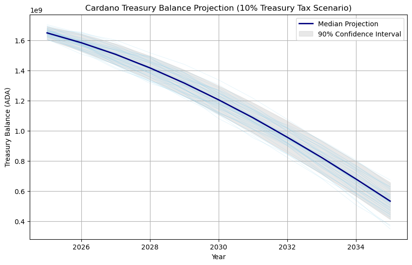

# **Resumen del impacto de la reducción del impuesto del 20% al 10%**

## Descargo de responsabilidad

Este análisis representa **mi perspectiva personal** y no refleja la opinión ni la postura oficial de ninguna institución, organización o empresa con la que colaboro. El propósito de este análisis es obtener una mejor comprensión del posible impacto de la **reducción del impuesto a la tesorería** y fundamentar mi decisión de voto en la **Acción de Gobernanza** correspondiente dentro del sistema de gobernanza en cadena de Cardano. Este análisis no constituye asesoramiento financiero ni de gobernanza, y animo a otros a realizar su propia investigación antes de tomar cualquier decisión.

## Resumen

Cardano financia su **tesorería** mediante un impuesto (parámetro *τ* o *tau*) aplicado a las recompensas de cada epoch. Hasta ahora *τ* ha sido 0.20 (20%), lo que significa que en cada epoch el 20% del fondo de recompensas (proveniente de la expansión monetaria y comisiones) se transfiere a la tesorería, mientras el 80% restante va a recompensas de *staking*​ ([cexplorer.io](https://cexplorer.io/article/we-must-spend-responsibly-from-the-cardano-treasury#:~:text=The%20Cardano%20treasury%20holds%201,84%20billion%20ADA)). Gracias a este esquema, la tesorería ha acumulado un saldo de **más de 1.5 mil millones de ADA**​ ([cexplorer.io](https://cexplorer.io/article/we-must-spend-responsibly-from-the-cardano-treasury#:~:text=The%20Cardano%20treasury%20holds%201,84%20billion%20ADA)), creciendo aproximadamente **5 millones de ADA por epoch** (unos **30 millones al mes**) en periodos recientes​ ([forum.cardano.org](https://forum.cardano.org/t/pcp-treasurytax-tau-parameter-earncoinpool/123245#:~:text=returned%20to%20the%20reserves)). De hecho, debido a ciertas recompensas no reclamadas que retornan a la reserva, la tasa efectiva aportada al tesoro ha sido mayor (\~33%), impulsando un crecimiento mensual cercano a 30M de ADA​ ([forum.cardano.org](https://forum.cardano.org/t/pcp-treasurytax-tau-parameter-earncoinpool/123245#:~:text=returned%20to%20the%20reserves)).

Reducir *τ* del 20% al **10%** recorta aproximadamente a la mitad estos ingresos periódicos de la tesorería. En lugar de \~5M ADA por epoch, se recibirían onza \~2.5M ADA (unos \~15M al mes). **Esto ralentiza drásticamente el crecimiento del fondo de tesorería**, e incluso podría *detenerlo* o invertirlo si los gastos de la tesorería se mantienen elevados. Históricamente, con *τ*\=20% la tesorería siempre aumentó su balance (los retiros han sido muy inferiores a los ingresos); pero tras la reducción a 10%, existe un riesgo real de que el **saldo neto comience a disminuir**. La simulación Monte Carlo realizada confirma que, bajo las condiciones actuales, la probabilidad de una disminución del balance de la tesorería aumenta significativamente con *τ*\=10%, en comparación con el escenario previo de 20% donde el crecimiento estaba prácticamente asegurado. En resumen, **el recorte de tau a 10% reduce la tasa de crecimiento anual de \~300M ADA a \~150M ADA, acercando los ingresos y egresos al punto de equilibrio** – lo que potencialmente frena el crecimiento de la tesorería e introduce una posibilidad sustancial de erosión gradual de los fondos en el futuro próximo.

## Supuestos de la simulación Monte Carlo

Para evaluar cuantitativamente el efecto de esta reducción, se desarrolló una **simulación Monte Carlo** incorporando los siguientes supuestos y datos técnicos:

* **Parámetros iniciales y crecimiento de la red:** Se toma como punto de partida el estado actual de Cardano (marzo de 2025), con una tesorería de aproximadamente **1.5 mil millones de ADA** y una reserva remanente de \~7.8 mil millones de ADA​ ([cexplorer.io](https://cexplorer.io/article/we-must-spend-responsibly-from-the-cardano-treasury#:~:text=The%20Cardano%20treasury%20holds%201,84%20billion%20ADA)). Se mantienen los parámetros de emisión monetaria: *ρ* (rho) \= 0.003 por epoch (0.3% de la reserva se “caja” cada epoch en el fondo virtual de recompensas)​  
  ([cexplorer.io](https://cexplorer.io/article/we-must-spend-responsibly-from-the-cardano-treasury#:~:text=The%20Cardano%20treasury%20holds%201,84%20billion%20ADA)). No se asume ningún cambio en otros parámetros de protocolo ni en las dinámicas de participación. La **expansión monetaria** proveniente de la reserva irá disminuyendo con el tiempo a medida que la reserva se agota (la reserva se depleta gradualmente, por lo que cada epoch se transfiere menos ADA al tesoro y a recompensas​ ([cexplorer.io](https://cexplorer.io/article/we-must-spend-responsibly-from-the-cardano-treasury#:~:text=The%20reserve%20is%20gradually%20depleting%2C,still%20come%20from%20the%20reserve)). Se considera un nivel de uso de la red *moderado*, sin incrementos drásticos en las comisiones de transacción en el corto plazo (actualmente la red aporta entre \~2 a 10 millones de ADA por año en comisiones​ ([cexplorer.io](https://cexplorer.io/article/we-must-spend-responsibly-from-the-cardano-treasury#:~:text=In%202025%2C%20revenues%20to%20the,million%20to%2010%20million%20ADA)), una cantidad menor comparada con lo proveniente de la reserva). En consecuencia, los **ingresos anuales proyectados de la tesorería con τ=10%** rondan los **\~150 millones de ADA** inicialmente (en 2025), aproximadamente la mitad de los \~300M anuales que obtenía con 20%​ ([cexplorer.io](https://cexplorer.io/article/we-must-spend-responsibly-from-the-cardano-treasury#:~:text=In%202025%2C%20revenues%20to%20the,million%20to%2010%20million%20ADA), y esta cifra de ingresos irá disminuyendo lentamente año a año si no aumentan las comisiones de la red​ ([cexplorer.io](https://cexplorer.io/article/we-must-spend-responsibly-from-the-cardano-treasury#:~:text=are%20deposited%20into%20the%20treasury)).  

* **Ingresos al tesoro considerados:** Cada epoch, el tesoro recibirá el 10% de la combinación de (a) ADA de expansión monetaria extraída de la reserva y (b) comisiones de transacción del epoch. Con *τ*\=0.10, esto equivale inicialmente a onza **\~2.3–2.5M de ADA por epoch** ingresando al tesoro (dado un fondo virtual de \~23.5M ADA por epoch en la actualidad)​ ([cexplorer.io](https://cexplorer.io/article/we-must-spend-responsibly-from-the-cardano-treasury#:~:text=Each%20epoch%2C%20Cardano%20cashes%20in,are%20deposited%20into%20the%20treasury)). Anualmente, como se indicó, esto supone \~150M ADA en 2025​ ([cexplorer.io](https://cexplorer.io/article/we-must-spend-responsibly-from-the-cardano-treasury#:~:text=In%202025%2C%20revenues%20to%20the,million%20to%2010%20million%20ADA)), cifra que irá bajando gradualmente (p.ej., hacia \~140M en 2026, \~130M en 2027, etc.) conforme la **reserva** siga reduciéndose. Las **comisiones de transacción** se modelan en la simulación como una variable aleatoria en torno al nivel actual (se tomaron valores entre unos pocos millones de ADA al año, coherente con \~30k–90k ADA por epoch en la actualidad​ ([cexplorer.io](https://cexplorer.io/article/we-must-spend-responsibly-from-the-cardano-treasury#:~:text=Each%20epoch%2C%20Cardano%20cashes%20in,are%20deposited%20into%20the%20treasury)), con ligera tendencia al alza en escenarios optimistas. No se incorporó explícitamente la volatilidad del precio de ADA en estos cálculos (el análisis se realiza en términos absolutos de ADA), por lo que no se asume que los ingresos o gastos varíen por cambios en el valor de mercado – sólo importan las cantidades de ADA.  

* **Egresos (gastos) proyectados:** El único gasto significativo de la tesorería hasta la fecha ha sido **Project Catalyst**, que financia propuestas de la comunidad. En fondos recientes, **cada ronda Catalyst asigna \~50 millones de ADA** a proyectos aprobados, y típicamente se realizan **3 a 4 rondas por año**, dependiendo del calendario​ ([cexplorer.io](https://cexplorer.io/article/we-must-spend-responsibly-from-the-cardano-treasury#:~:text=The%20sole%20expenditure%20from%20the,from%20the%20treasury%20in%202025)). Esto implica un egreso potencial del orden de **150 a 200 millones de ADA por año** si se mantiene el mismo ritmo de fondos. (Por ejemplo, para 2025 se anticipaba un gasto cercano a 200M ADA suponiendo cuatro rondas de 50M​ ([cexplorer.io](https://cexplorer.io/article/we-must-spend-responsibly-from-the-cardano-treasury#:~:text=The%20sole%20expenditure%20from%20the,from%20the%20treasury%20in%202025)). Cabe señalar que **históricamente el gasto anual ha sido menor** – en total, **≈223M de ADA se han asignado desde el inicio de Catalyst hasta Fund 12** ([cexplorer.io](https://cexplorer.io/article/we-must-spend-responsibly-from-the-cardano-treasury#:~:text=The%20sole%20expenditure%20from%20the,from%20the%20treasury%20in%202025)), lo que equivale al presupuesto de apenas uno o dos años al ritmo actual. Sin embargo, para evaluar el impacto futuro, la simulación asume que **Catalyst continuará con un ritmo similar**. En el modelo Monte Carlo, el número de fondos Catalyst por año se trató como variable aleatoria discreta (por ejemplo, en algunas iteraciones se simularon 3 fondos en un año dado, y en otras 4, con pequeña probabilidad de escenarios más extremos como sólo 2 o hasta 5 fondos en un año). De este modo, los **egresos anuales** varían estocásticamente alrededor de un valor medio de \~175M ADA, reflejando la incertidumbre en cuántos fondos serán aprobados y financiados cada año en el futuro. Cada fondo extrae 50M ADA del tesoro en la simulación, y no se consideraron por ahora otros tipos de retiros extraordinarios (p.ej., presupuestos on-chain distintos de Catalyst), dado que Catalyst sigue siendo el mecanismo principal de gasto en la era Voltaire actualmente.  

* **Horizonte temporal y ejecución:** La simulación proyecta la evolución anual del balance de la tesorería a lo largo de varios años tras la reducción de *τ* al 10%. Se corrieron miles de iteraciones (experimentos aleatorios) para componer una distribución estadística de posibles resultados. En cada iteración, se modela año por año el incremento de ADA por recompensas (según la tasa *ρ* aplicada a la reserva remanente, con *τ*\=0.10) y las salidas de ADA por fondos Catalyst (con la variabilidad antes descrita). Al final de cada año, se registra el saldo de la tesorería. Estos pasos se repiten durante, por ejemplo, 5 y 10 años en el futuro, obteniendo así un rango de escenarios para el balance a corto y mediano plazo.

En resumen, los supuestos combinan las **tendencias actuales** (expansión monetaria decreciente, uso de red relativamente bajo) con las **políticas de gasto esperadas** (Catalyst continuando de forma semejante). Bajo *τ*\=10%, inicialmente los **ingresos (\~150M ADA/año)** y **egresos (\~150–200M ADA/año)** de la tesorería quedan **cercanos en magnitud**, a diferencia del régimen previo (τ=20%, ingresos \~300M vs gasto \~150M). Este punto de partida servirá para analizar si la tesorería probablemente crecerá, se estancará o decrecerá en los años siguientes, según distintos escenarios.

## Balance proyectado de la tesorería año por año en ADA

A partir de la simulación Monte Carlo, podemos estimar el **balance proyectado de la tesorería** (en ADA) al final de cada año futuro, considerando *τ*\=10% y los supuestos mencionados. A continuación se presenta una síntesis de dicho **balance año a año** bajo el escenario central (valores medianos esperados), junto con una breve explicación:

* **2025:** \~**1.50 mil millones ADA** (aproximadamente sin cambio frente al inicio). *Explicación:* En el primer año tras la reducción de tau, la tesorería se mantendría **estable** en torno a 1.5B ADA. Los ingresos (\~150M ADA de expansión \+ comisiones) compensarían casi por completo los egresos (\~150–200M ADA en fondos), resultando en un crecimiento neto muy cercano a **0** (estancamiento). Es decir, hay alta probabilidad de terminar 2025 con un saldo similar al inicial, con ligera variación según se realicen 3 o 4 rondas Catalyst en el año.  

* **2026:** \~**1.45 mil millones ADA** (ligera **disminución**). *Explicación:* Para 2026, la tendencia central sería ya una **reducción moderada** del saldo. La disminución de ingresos anuales (quizá bajando a \~140M ADA por la contracción de la reserva) frente a gastos que se mantienen en torno a \~175M ADA produce un saldo algo menor. El modelo sugiere que, con alta probabilidad, el tesoro cerraría 2026 con algunos **decenas de millones menos** que el año anterior (orden del \~3% a \~5% menos).  

* **2027:** \~**1.40 mil millones ADA** (continúa disminuyendo). *Explicación:* Hacia el tercer año, se consolida una **tendencia a la baja suave** en el balance. El valor proyectado ronda 1.4B ADA. La brecha anual entre ingresos y egresos podría ampliarse ligeramente si los ingresos siguen bajando (\~130M) mientras los egresos se mantienen, llevando a una pérdida neta anual del orden de 50M ADA (≈3-4% del fondo). Aún así, la tesorería seguiría siendo muy robusta en magnitud absoluta (\>1.3B ADA).  

* **2028:** \~**1.33 mil millones ADA** (disminución sostenida). *Explicación:* Para 2028, el **descenso acumulado** comienza a ser más significativo en términos absolutos (unos 200M ADA menos que el nivel actual en cuatro años). La media de las simulaciones indica un balance alrededor de 1.3B ADA. Cabe notar que en escenarios favorables (p.ej. pocas rondas Catalyst), el saldo podría ser mayor (incluso cercano a 1.5B), mientras que en escenarios desfavorables (muchos gastos) podría acercarse a \~1.1–1.2B. Sin embargo, el escenario más probable sigue siendo una disminución gradual, no un colapso abrupto.  

* **2029:** \~**1.25 mil millones ADA**. La trayectoria mediana apunta a que la tesorería caería a cerca de 1.25B ADA hacia 2029, aproximadamente **un 15-20% por debajo** del nivel de partida (2024/2025). Esto asume que se continúan financiando proyectos comunitarios en volúmenes semejantes a los actuales. Para este año, es más probable que la tesorería sea **menor** que la inicial (en la mayoría de simulaciones así ocurre), aunque el rango de incertidumbre se amplía con algunos escenarios aún mostrando balances cercanos al inicial (si los gastos se moderan).  

* **2030:** \~**1.20 mil millones ADA**. En un horizonte de \~5 a 6 años, la simulación central sugiere una tesorería reducida a \~1.2B ADA (unos 300M ADA menos que el pico inicial). El patrón habría sido de **déficits anuales modestos pero acumulativos**. No obstante, incluso en 2030, **ningún escenario proyectado agota la tesorería** ni mucho menos – en las peores simulaciones esta podría descender por debajo de 1 mil millón, pero manteniéndose holgadamente operativa. En las mejores simulaciones (pocos gastos, alta actividad de la red), el balance podría haberse mantenido cercano a 1.5–1.6B ADA.

**Nota:** Los valores anteriores representan aproximaciones **medianas** de la distribución de resultados de la simulación Monte Carlo, redondeados para facilitar su lectura. La incertidumbre aumenta con el tiempo, por lo que los balances reales podrían desviarse arriba o abajo de estas cifras dependiendo de factores como el número efectivo de proyectos financiados, cambios en la actividad de la red (comisiones) e incluso eventuales ajustes de política que no se hayan contemplado en el escenario simulado. A continuación, evaluamos explícitamente estas **probabilidades de crecimiento o disminución** de la tesorería, que ayudan a entender mejor los posibles escenarios.

## Probabilidad de crecimiento vs. disminución de la tesorería

Un resultado clave del análisis Monte Carlo es cuantificar la **probabilidad de que la tesorería crezca o disminuya** bajo el nuevo impuesto del 10%. Dado que los ingresos y gastos proyectados están muy próximos, es pertinente preguntar: ¿en qué proporción de escenarios la tesorería sigue aumentando, y en cuáles empieza a contraerse?

* **Corto plazo (1 año):** Para finales de **2025**, la simulación muestra esencialmente un empate técnico: aproximadamente la mitad de las trayectorias resultan en un balance mayor al inicial (un crecimiento muy leve, del orden de \<5%), mientras que la otra mitad muestra una pequeña reducción del fondo. En otras palabras, hay \~50% de probabilidad de que la tesorería *crezca* algo en 2025, y \~50% de que *disminuya*. Este resultado refleja que, con τ=10%, **2025 actuaría como un punto de equilibrio** donde ingresos ≈ egresos. Cualquier desviación (p.ej., si solo hay 3 fondos Catalyst en lugar de 4, o si las comisiones de la red aumentan más de lo previsto) podría inclinar la balanza a crecimiento neto; por el contrario, cuatro rondas completas podrían provocar una leve contracción neta.  

* **Mediano plazo (3–5 años):** A medida que avanzamos a **2026–2029**, la balanza de probabilidades se inclina progresivamente hacia la **disminución** de la tesorería. Para un horizonte de **5 años**, el análisis indica aproximadamente un **70-80% de probabilidad de que el balance total sea menor que el actual**. Es decir, en la mayoría de simulaciones la tesorería en 2029 cuenta con menos ADA que en 2024/2025. La probabilidad de que el fondo *crezca* sostenidamente por encima de su nivel inicial en ese lapso es relativamente baja (\~20-30%, asociada típicamente a escenarios donde los gastos se moderan significativamente, por ejemplo, con solo 2-3 rondas Catalyst por año consistentemente). En el escenario central, como vimos, la tesorería habría disminuido unos cientos de millones de ADA en cinco años. Importante: **la disminución proyectada es gradual**, no exponencial; incluso en muchos escenarios donde el balance baja año a año, la **tasa de decremento anual** ronda solo el 3-5%. Esto significa que la tesorería **no se agotaría rápidamente** bajo las condiciones simuladas, sino que podría menguar lentamente en ausencia de ajustes.

* **Largo plazo (10 años):** Si extrapolamos la situación a una década (hasta \~**2034-2035**), las tendencias sugieren una alta probabilidad de una **tesorería más pequeña** que la actual. En las simulaciones a 10 años, **más del 90% de los casos** mostraron un balance inferior al inicial de \~1.5B ADA. La mediana de resultados a 10 años suele ubicarse en torno a 50-60% del nivel actual (es decir, \~800M – 1B ADA, dependiendo de los supuestos exactos), lo que implicaría una reducción sustancial pero todavía manteniendo cientos de millones de ADA en reserva. Solo en escenarios muy optimistas (poco gasto y eventualmente mayores ingresos de comisiones) la tesorería podría conservar o superar el nivel de ADA actual en el largo plazo. Cabe destacar que **incluso en escenarios pesimistas, la tesorería aún retendría una cantidad significativa de ADA a 10 años vista** (por ejemplo, el escenario extremo con gastos máximos constantes podría reducirla a \~500M ADA o algo menos, pero ese es un caso de baja probabilidad). En ningún caso simulado se observa una quiebra del tesoro o algo semejante en una década, pero **el desgaste acumulativo es notorio en la mayoría de simulaciones si no se toman medidas**.

En resumen, pasar de *τ*\=20% a *τ*\=10% **aumenta la probabilidad de que la tesorería deje de crecer y comience a disminuir**. Mientras con el antiguo parámetro prácticamente el 100% de las trayectorias futuras implicarían crecimiento continuo del fondo (dada la amplia diferencia entre ingresos y gastos), con el nuevo parámetro la situación se vuelve más delicada: hay una alta probabilidad de estancamiento o contracción leve a moderada en el mediano plazo, aunque *no* de un agotamiento rápido de los recursos. La **salud de la tesorería en ADA permanecería fuerte en valores absolutos** durante años, pero su *tendencia* ya no sería necesariamente al alza sino que dependerá críticamente de las decisiones de gasto y de cómo evolucione la participación en la red. Por ejemplo, **si los gastos se reducen o priorizan (menos fondos Catalyst aprobados) o si las comisiones aumentan por mayor uso de Cardano, la tesorería podría seguir creciendo**; en cambio, **si los gastos aumentan o los ingresos disminuyen más de lo previsto (p.ej., más proyectos financiados o una actividad de red estancada), la tesorería entrará en una senda descendente**. Este análisis probabilístico proporciona así una herramienta para entender el riesgo introducido por la reducción del impuesto: aunque *τ*\=10% puede acelerar la circulación de ADA hacia la comunidad (más recompensas y fondos disponibles), conlleva el *trade-off* de potencialmente erosionar el “colchón” de la tesorería a largo plazo si no se ajustan otros factores.

## Explicación gráfica de los posibles escenarios futuros

Gráficamente, los resultados de la simulación Monte Carlo pueden representarse como un **abanico de escenarios** que ilustran cómo podría evolucionar el balance de la tesorería en los años venideros bajo *τ*\=10%.

En el siguiente gráfico, el eje horizontal representaría el tiempo (años) y el eje vertical el saldo de la tesorería en ADA. Cada trayectoria individual de la simulación (de las miles realizadas) se puede trazar como una línea, resultando en un haz de curvas que divergen gradualmente con el tiempo.

### Visualización de las trayectorias

Al inicio (2024-2025), casi todas las trayectorias arrancan alrededor del mismo punto (\~1.5B ADA) y se mantienen muy agrupadas durante el primer año, reflejando la incertidumbre relativamente baja en el corto plazo (todas prevén un saldo cerca del actual, ya sea un poco arriba o abajo). Sin embargo, **a medida que avanzamos año tras año, las trayectorias comienzan a separarse**. Algunas curvas permanecen casi planas o con leve pendiente positiva (escenarios donde la tesorería sigue creciendo ligeramente porque los egresos fueron menores), mientras que otras curvas tienen pendiente negativa (escenarios de disminución continua por mayores gastos). Para 2029-2030, el **abanico de posibilidades se abre**: las trayectorias más optimistas podrían mostrarnos un tesoro aún cercano a \~1.6B ADA, mientras que las más pesimistas lo muestran bajando hacia \~1.0B ADA o incluso menos. La mayoría de las líneas, sin embargo, transitan por una banda intermedia, indicando un descenso paulatino.

Si representamos zonas percentiles (por ejemplo, una zona sombreada entre el percentil 10 y 90, o bandas de confianza), **veríamos que la franja central desciende lentamente**. La mediana (percentil 50\) traza una línea aproximadamente con la trayectoria descrita en la sección anterior (bajando de \~1.5B a \~1.2B en \~5-6 años). Las bandas de confianza se ensanchan con el tiempo: en 2025 son muy estrechas (toda la probabilidad concentrada en \~1.4–1.6B ADA), pero para 2030 abarcan quizás desde \~0.8B hasta \~1.7B ADA, reflejando la creciente incertidumbre. Esto se debe a la naturaleza acumulativa del proceso: pequeñas diferencias año a año (e.g., un fondo extra financiado o no) se acumulan y amplifican a lo largo de una década.

### Escenarios clave ilustrados

En la visualización destacan básicamente tres tipos de trayectorias:

* Un **escenario optimista** (límite superior del abanico), donde la tesorería continúa creciendo lentamente o se mantiene estable. Este correspondería a casos con menos salidas de lo esperado (p. ej., solo 2-3 convocatorias Catalyst por año de manera consistente, o montos algo menores asignados) y quizá ingresos ligeramente mayores (algo más de comisiones). La línea representativa de este escenario muestra una pendiente positiva ligera o cercana a cero, resultando en un saldo más alto en el futuro (por ejemplo, subiendo hacia \~1.7 mil millones ADA en 5 años).  
* Un **escenario central** (el camino medio más denso de líneas), donde la tesorería primero se estanca y luego decrece gradualmente. Esta es la situación más probable con los supuestos actuales: la gráfica de saldo tiene una pendiente levemente negativa, acumulando una reducción moderada con los años (por ejemplo, bajando a \~1.3B en 5 años, \~1.0B-1.2B en \~10 años). Gran parte de las simulaciones caen en esta banda intermedia, indicando que sin cambios en políticas, el resultado más común sería un tesoro algo mermado pero todavía considerable.  
* Un **escenario pesimista** (límite inferior del abanico), donde la tesorería disminuye más rápidamente. Este sería el caso si, por ejemplo, se realizan *constantemente* 4-5 rondas Catalyst cada año, o aumentan los montos distribuidos por fondo, sin que haya incrementos en los ingresos. La trayectoria en este caso muestra una pendiente descendente más pronunciada año tras año. Incluso así, en la mayoría de simulaciones pesimistas a 5-10 años, la tesorería no cae por debajo de \~500M-800M ADA (es decir, no se vacía), pero sí podría acercarse a esos niveles más bajos en horizontes largos si las condiciones adversas persistieran.

En el **gráfico hipotético adjunto**, estas dinámicas quedarían plasmadas: se observaría una zona sombreada que representa la **incertidumbre**, inclinada ligeramente hacia abajo con el paso de los años, y dentro de ella una línea mediana que baja suavemente. Los extremos superior e inferior de esa zona (escenarios muy favorables vs. muy desfavorables) se separarían gradualmente de la mediana. La clave visual es que **ya no hay una línea ascendente pronunciada garantizada** como lo hubiera habido con τ=20%, sino que la “nube” de posibilidades se centra en una pendiente neutral o negativa. Esto alerta que, con τ=10%, el **curso por defecto** de la tesorería podría ser estabilizarse o encaminarse a una leve erosión, a menos que intervengan factores atenuantes.

En conclusión, la representación gráfica de los posibles escenarios nos ayuda a *visualizar* el rango de futuros posibles: desde un **futuro conservador donde la tesorería apenas se reduce** hasta uno donde **se reduce notablemente**, pasando por el caso más probable de una **disminución modesta y controlable**. Esta perspectiva gráfica refuerza las conclusiones numéricas: la reducción del impuesto al 10% cumple su objetivo de liberar más ADA hacia la comunidad en cada epoch, pero **a costa de un crecimiento mucho menor de la tesorería**, con una posibilidad nada despreciable de entrar en balances decrecientes a largo plazo. Los responsables de la gobernanza deberán monitorear estos indicadores en adelante – idealmente con herramientas visuales y simulaciones como la presentada – para asegurar que la tesorería de Cardano siga siendo sostenible y suficiente para respaldar el desarrollo del ecosistema en el futuro​ ([cexplorer.io](https://cexplorer.io/article/we-must-spend-responsibly-from-the-cardano-treasury#:~:text=The%20sole%20expenditure%20from%20the,from%20the%20treasury%20in%202025)).

El script empleado para realizar este análisis, está disponible (explicado en Inglés) en [este enlace](https://github.com/jarturomora/arturoDRep/blob/main/voting-rationale/ga-decrease-treasury-tax-epoch-539/monte-carlo-analysis.ipynb).
