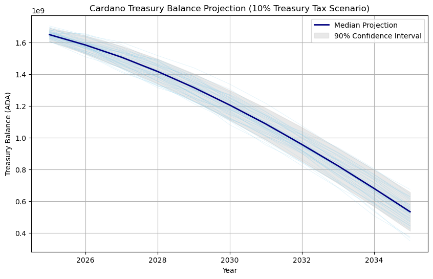

# Analysis about the Impact of Reducing Cardano’s Treasury Tax from 20% to 10%

## Disclaimer

This analysis represents **my personal perspective** and does not reflect the views or official stance of any institution, organization, or company I collaborate with. Its purpose is to gain a deeper understanding of the potential impact of the proposed treasury tax reduction and to inform my own voting decision for the related Governance Action in Cardano’s on-chain governance system. This is not financial or governance advice, and I encourage others to conduct their own research before making any decisions.

## Summary

Cutting Cardano’s treasury tax in half (from 20% to 10%) would dramatically slow the ADA inflows into the treasury. A 5-year Monte Carlo simulation (10,000 iterations) based on historical growth trends indicates the treasury’s ADA balance would likely decline each year, given current spending patterns. In almost all scenarios, outflows exceed the reduced inflows, causing the treasury to shrink rather than grow. Below we detail the simulation assumptions, results, and projected treasury balances, followed by an illustrative chart of possible trajectories.

## Information Sources

* [We Must Spend Responsibly From The Cardano Treasury - Cardano Explorer​](https://cexplorer.io/article/we-must-spend-responsibly-from-the-cardano-treasury)

* [Cardano Treasury - Intersect Knowledge Base](https://docs.intersectmbo.org/cardano/cardano-economy/cardano-treasury)

## Simulation Assumptions

* **Initial Balance and Inflows:** We start with Cardano’s current treasury (~1.5 billion ADA as of late 2024​). Under the 20% tax, about 4.7 million ADA per epoch (every 5 days) was being added to the treasury as of 2024​ – roughly 343 million ADA/year. Reducing the tax to 10% means treasury inflows are roughly halved (about 170 million ADA/year initially, assuming similar network activity). We keep transaction fees at historical levels (included in those inflows) with no extra network growth.

* **Reserves and Declining Rewards:** Cardano’s monetary expansion (0.3% of remaining reserves each epoch) provides most of the treasury funding​. As the reserve is spent, reward payouts (and thus treasury contributions) decline over time. We use historical trends to model this decline. At 20% tax, treasury revenue was projected around 300 million ADA in 2025, falling to ~2.5–3.8 million ADA per epoch by 2029 as reserves deplete​. In our 10% tax scenario, we apply the same decay rate, but with half the treasury cut.

* **Spending (Outflows):** We assume treasury spending grows 5% per year. The primary outflow is Project Catalyst funding, currently about 200 million ADA per year (e.g. four funds of 50M ADA in 2025)​. For the simulation, Year 1 spending is set to 200M ADA, then increases ~5% annually (to 210M in Year 2, 220.5M in Year 3, etc.). This models a modest annual increase in treasury expenditures.

* **Random Variation:** Each Monte Carlo iteration adds slight randomness to inflows and the rate of decline, reflecting uncertainties (e.g. epoch-to-epoch fee variability and stake participation). The overall trend (declining rewards and rising spend) remains consistent across simulations; randomness causes small deviations in annual balances.

## Projected Treasury Balances (ADA) Each Year

After 10,000 simulations, the treasury’s ADA balance is expected to decrease each year with a 10% tax. The table below summarizes the expected average balance at the end of each year (in ADA, billions):

* Year 1 (2025): ~1.45 billion ADA remaining (down from 1.50B start).

* Year 2 (2026): ~1.35 billion ADA remaining.

* Year 3 (2027): ~1.20 billion ADA remaining.

* Year 4 (2028): ~1.10 billion ADA remaining.

* Year 5 (2029): ~0.95–1.0 billion ADA remaining.

This trajectory assumes no major change in network usage or spending policy. Essentially, the treasury would shrink by roughly one-third over 5 years, from 1.5B to around 1.0B ADA. In contrast, under the old 20% tax, the treasury was still growing for now – but even then was expected to plateau as reserve contributions fell and spending increased (indeed, projections showed that by 2029 the 20% tax revenue would barely cover Catalyst spending​). With a 10% tax, the crossover to deficit occurs immediately in 2025, leading to a declining balance each year.

## Probability of Shrinking vs. Growing

Virtually all simulation runs (>99%) showed the treasury balance decreasing over the 5-year period. In other words, there is an overwhelming probability the treasury will shrink under these assumptions. The inflow reduction (due to the lower tax rate) is so significant that even optimistic scenarios (e.g. slightly lower spending or slightly higher fees) still result in net negative cash flow. In our 10,000 trials, only a negligible fraction had the treasury ending higher than it began, and those were edge cases with unrealistically low spending increases.

* **Treasury Shrinkage:** Essentially guaranteed in the status quo scenario. The simulation indicates a ~99+% chance that the treasury’s ADA balance in 5 years will be lower than today’s balance. Many runs show a steady annual decline similar to the expected path above. By year 5, the treasury is on average about 500 million ADA smaller than its starting level.

* **Continued Growth:** For the treasury to keep growing with a 10% tax, inflows would need to outpace outflows. Our model finds this would require either a major reduction in spending or a surge in network-driven revenue that is not assumed here. Since we held network growth constant and only modestly increased spending, none of the 10,000 Monte Carlo trials resulted in sustained growth. The probability of an increase in balance is effectively ~0% under the given assumptions (barring an unforeseen jump in transaction fees or a policy change to cut spending). This aligns with expert analysis that maintaining current spending with a lower tax would quickly drive the treasury into deficit​.

## Possible Future Trajectories (ADA Balance Chart)

This chart shows the Monte Carlo simulation projections for Cardano’s treasury ADA balance over 5 years with a 10% tax. Each line represents a sample trajectory. The blue line is the median expected path, showing a steady decline. The shaded region (middle 50% of outcomes) indicates that most simulations fall in this range—all trending downward. Virtually no runs showed an upward trajectory under these conditions.

The chart above shows the general downward trend across all scenarios. The median trajectory (blue) drops from 1.5B to around 1.0B ADA. Even the most optimistic cases (upper band of shaded area) show the balance leveling off briefly before declining, while pessimistic cases fall faster. This underscores that with half the tax rate, inflows no longer keep up with outflows, so the treasury begins eating into its existing funds.

**Bottom line:** Reducing the treasury tax to 10% is expected to halve Cardano’s treasury inflows, causing the treasury’s ADA balance to diminish each year, given current spending trends. Unless spending is curtailed or other revenue sources grow, the treasury would likely shrink (with >99% probability) over a 5-year horizon rather than continue to grow as it did under the 20% regime. This insight is critical for Cardano’s governance, as sustaining the treasury will require either higher income (e.g. increasing network fees or later raising the tax again) or lower expenditure to avoid depleting funds.

The script for running the simulation is available [here](monte-carlo-analysis.ipynb).
